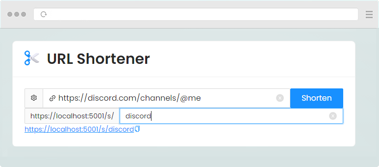

# UrlShortener
  

Web application for shortening links using **[ASP.NET Core][1]**. For the frontend, Blazor is used with the **[Ant Design of Blazor][2]** UI framework  

## :blue_book: Description

The application receives a *long URL* as input, and then converts it into a *shorter link* that follows the original path like this:  
`https://your_domain/s/discord` -> `https://discord.com/channels/@me`  
As a *alias* by default, a generated phrase consisting of 7 characters is used, including **only** letters and numbers.  
It is also possible to assign an arbitrary *alias* - a phrase consisting of letters, numbers and underscores. The length of such a phrase **must** be from 3 to 30 characters inclusive.

## :name_badge: Requirements

 - [.Net 5 SDK](https://dotnet.microsoft.com/download/dotnet/5.0)
There are **no** specific dependencies in the project

## :zap: Local Run

The application consists of two components: **Web UI (*based on Blazor*)** and the **Rest API service**.  
*Web UI application* is available at `https://localhost:5001/`  
To get information on *Rest API service* requests, use the **[Swagger UI][3]** interface at `https://localhost:5001/swagger`  

[1]: https://docs.microsoft.com/en-us/dotnet/core/dotnet-five
[2]: https://antblazor.com/
[3]: https://github.com/domaindrivendev/Swashbuckle.AspNetCore
